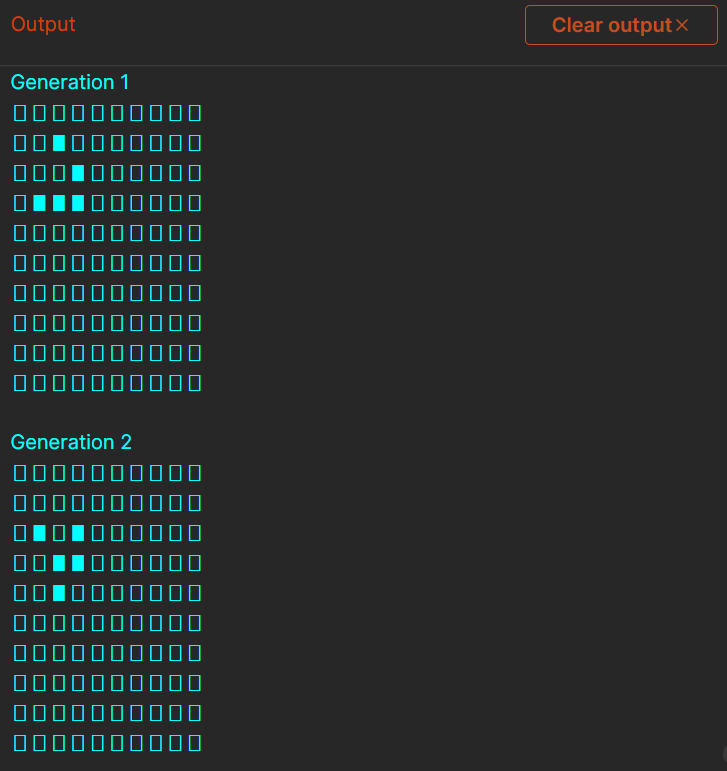
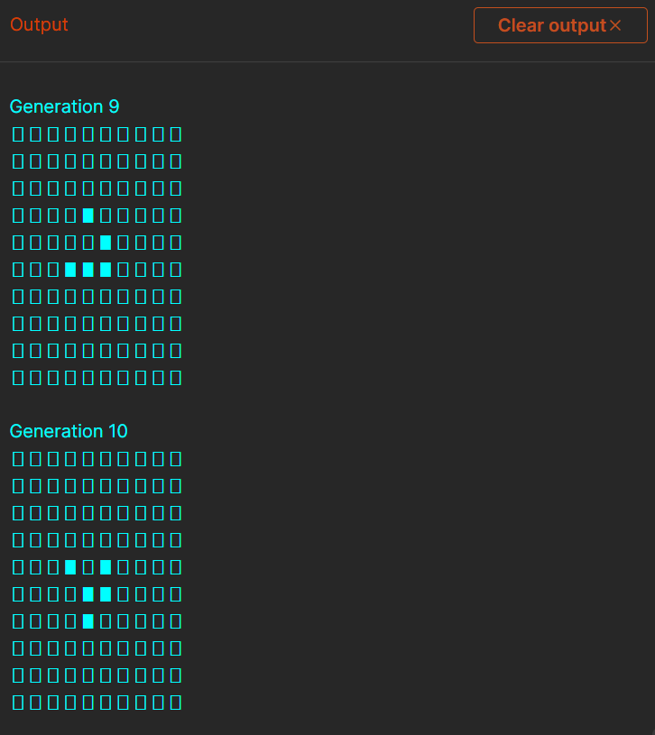

# Conway's Game of Life in OCaml

## Overview 🌟

Conway's Game of Life is a cellular automaton devised by mathematician John Conway. It's a zero-player game, meaning that its evolution is determined by its initial state, requiring no further input. It consists of a grid of cells which, based on a few mathematical rules, can live, die, or multiply over successive generations.

## Project Structure 📂

This project contains an OCaml implementation of the Game of Life with the following files:

- `game_of_life.ml`: The main source code for the game.
- `game_of_life_test.ml`: A test module with predefined scenarios.
- `init.sh`: A Bash script to compile the source code.
- `test.sh`: A Bash script to run tests.

## How It Works 🔍

The `game_of_life.ml` program initializes a grid of cells, with the size and initial state specified by the user. The grid evolves over a number of generations, with each cell's fate computed according to Conway's four rules:

1. Any live cell with fewer than two live neighbors dies, as if by underpopulation.
2. Any live cell with two or three live neighbors lives on to the next generation.
3. Any live cell with more than three live neighbors dies, as if by overpopulation.
4. Any dead cell with exactly three live neighbors becomes a live cell, as if by reproduction.

The `game_of_life_test.ml` contains static variables for grid size, number of generations, and initial states to demonstrate typical patterns such as "Blinkers", "Gliders", or "Pulsars".

## Getting Started 🚀

To run the Game of Life:

1. **Compile the Code**: Execute the `init.sh` script to compile both `game_of_life.ml` and `game_of_life_test.ml`. This script should be run first to generate the executable files.
   ```
   ./init.sh
   ```

2. **Run the Game**: After compilation, you can run the game using the generated executable. If you want to use your own initial conditions and grid size, run the game_of_life executable with the appropriate command-line arguments.
```
    ./game_of_life 10 10 "1,2 2,3 3,1 3,2 3,3"
```

3. **Run Tests**: To see the Game of Life in action with predefined test cases, run the test.sh script.
```
    ./test.sh
```

## Output Examples 🖼️

**Generation 1**: An initial configuration


**Generation 10**: After N iterations, showing complex patterns


## Contributions and Feedback 🤝

If you have suggestions for improvements or find any issues, please feel free to fork the repository and submit a pull request with your changes. You can also reach out to me:

- [LinkedIn](https://www.linkedin.com/in/neel-dandiwala/)